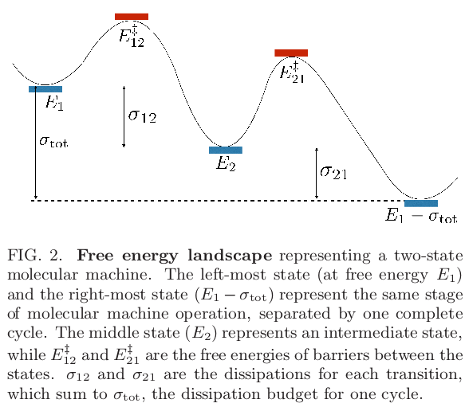

## Theory

### Allocating dissipation across a molecular machine cycle to maximize flux
Brown and Sivak [@arxiv:1703.05283v3] conclude that minimizing the depth (and
number, I think) of intermediate metastable states maximizes the flux.

Their model defines forward and reverse rate constants similar to our model,
although they deal with the input energy in a somewhat different manner. In our
case, nonequilibrium populations drive the system. Here, the energy difference
between the initial and final state of the system ($E_1$) drive the flux (see
Figure @fig:bs).

{ #fig:bs }

Raising the barrier ($E_2$), decreases the flux. Each barrier is associate with
some energy "dissipation" between the initial and final energy states (I think
this is just a free energy difference $\Delta E$ but there is probably some
reason why they chose $\sigma$ for these). It turns out that maximum flux does
not occur when there is an even dissipation of energy at each barrier. Rather,
there is an optimal distribution of these energy dissipation terms that depends
on the rate constants for each barrier. There may be a way to use this
information to look at the evolved surface splines, although the evolved splines have varying number of peaks and troughs.

> We find an unequal optimal dissipation allocation occurs when: the
nonequilibrium steady-state flux is maximized, rather than an efficiency or
power; optimization is subject to fixed total dissipation budget per cycle,
rather than fixed flux or entropy production rate; cycle transitions have
different bare rate constants, corresponding to different barrier heights; and
the ratio of forward and reverse rate constants varies exponentially, not
linearly, with dissipation ((2)).

This article interprets the results of Wagoner and Dill
[@doi:10.1021/acs.jpcb.6b02776] that flux is affected differently by changing
the individual rate constants for barrier crossing.

### Locked synchronous rotor motion in a molecular motor A new synchronous
rotary molecular motor from Feringa's group
[@url:http://science.sciencemag.org/content/sci/356/6341/964]. Štacko, et al.
demonstrate controlled rotary and translational motion in a geared,
unidirectional molecular motor. This motor is based off their 2nd generation
ones that was discussed at ACS 2017; there is a photochemical isomerization and
then a thermal helix inversion. Now, by introducing a new chemical substituent

(napthalene or biaryl here),

Random, thermal motions of the napthalene are suppressed.

A computational study was undertaken...

Helix inversion takes a reasonable 5.4 $\pm$ 1.8 seconds.

## Experiments

### Cyclodextrin Rotaxanes and Polyrotaxanes

[@doi:10.1021/cr970027+] Hydrophobic and van der Waals interactions drive the
formation of rotaxane with cyclodextrins. For polar guests, dipole-dipole
interactions may also play a role. In channel inclusions, many CD rings may be stacked like columns. 
